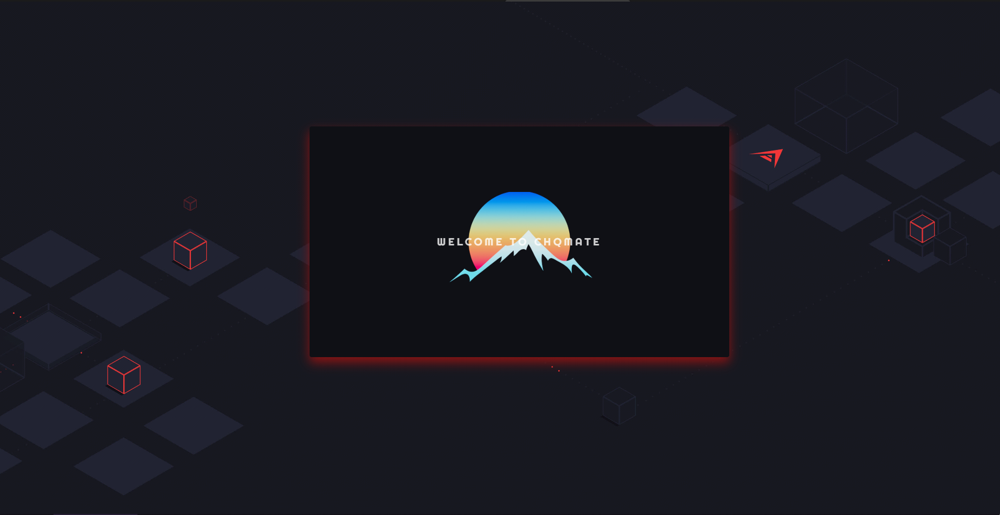

  
# Chq Mate 
***

***
## Description
A social media application that matches users to others with similar preferences for video games. Updates are being pushed regularly and new features are incoming at a rapid rate. Create and account or login to get started interacting with others and forming your party!
***
## Table of Contents
- Installation
- Usage
- Licensing Info
- Contributions
- Tests
- Creator Info
***
## Installation Requirements
No installation is needed! This app is hosted at https://chq-mate.herokuapp.com
***
## Usage
This project is open for any and all individuals to use and enjoy.
***
## Licensing Info
This project contains a GNU general public license
***
## Contributions
Contributions are welcomed! There are plenty of features we'd love to see soon and appreciate any and all recommendations or suggestions.
***
## Tests
This project does not currently feature any tests.
***
## Github Creators Info
Philip Lemaster, Mark Fomin, Andrew Gonzalez, Jonathan Modlin, Charles Price
